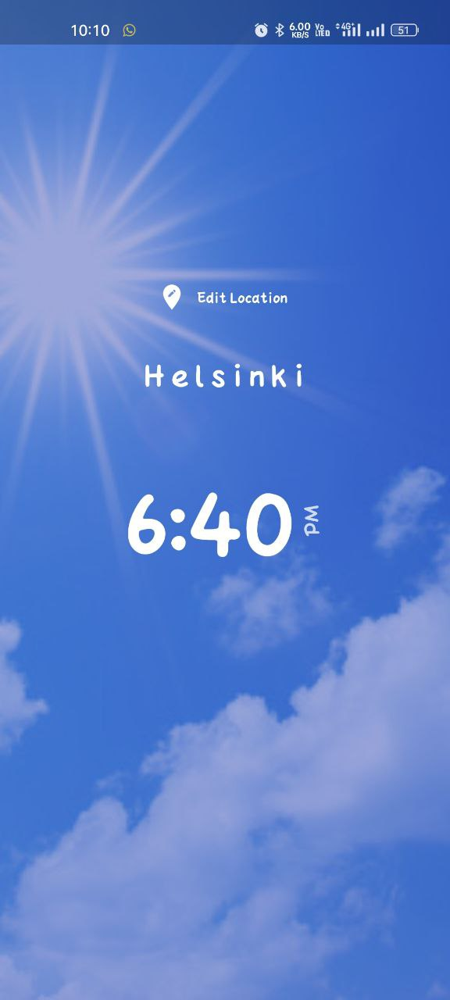

# World Time

Flutter project for World Time App
<h1> Here User can see the current time of any timezone</h1>

<!-- <a href="./build/app/outputs/apk/release/app-armeabi-v7a-release.apk" download="World Time">Download</a> -->

# How it Looks

<h2>Loading Page</h2>

 
<h2>During day time</h2>

 
 
<h2>During night time</h2>

 
 
  

<h1> This is a Project I built for learning purpose</h1>

## Getting Started

This project is a starting point for a Flutter application.

A few resources to get you started if this is your first Flutter project:

- [Lab: Write your first Flutter app](https://docs.flutter.dev/get-started/codelab)
- [Cookbook: Useful Flutter samples](https://docs.flutter.dev/cookbook)

For help getting started with Flutter development, view the
[online documentation](https://docs.flutter.dev/), which offers tutorials,
samples, guidance on mobile development, and a full API reference.
